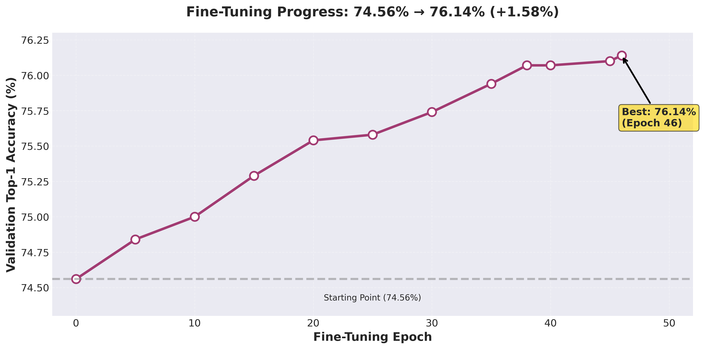
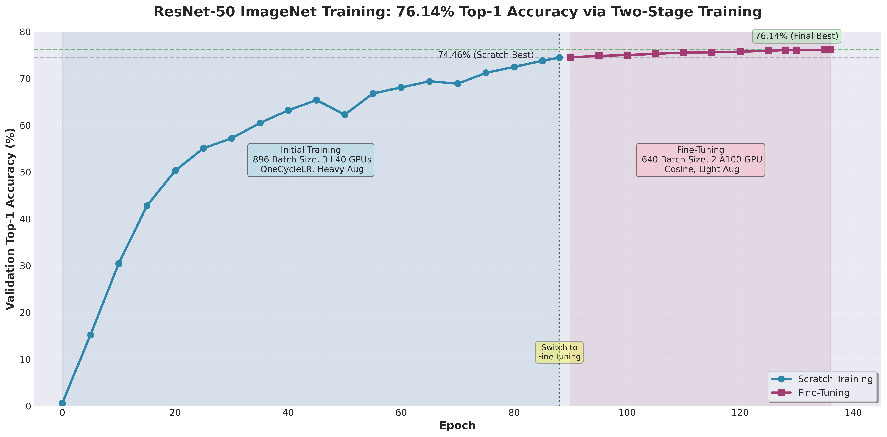

# 🏆 ResNet-50 ImageNet: 76.14% Top-1 Accuracy

<div align="center">

**Training ResNet-50 from scratch using Distributed Data Parallel (DDP) and fine-tuning to achieve 76.14% top-1 accuracy on ImageNet-1K**

*Achieving high accuracy through careful hyperparameter tuning and strategic two-stage training*

<p align="center">
  <a href="https://huggingface.co/spaces/agentic-snehanshu/ResNet50-ImageNet">
    
  </a>
</p>

</div>

---

## 📊 **Results Summary**

| Stage | Accuracy | GPUs | Time | Batch Size | Optimizer |
|-------|----------|------|------|-----------|-----------|
| **Scratch Training** | 74.46% | 3 × L40 | 16h | 896 | SGD + OneCycleLR |
| **Fine-tuning** | **76.14%** | 2 × A100 | 6h | 640 | SGD + Cosine Decay |
| **Total** | **+1.68%** | - | **22h** | - | - |

### **Key Metrics**
- 🎯 **76.14% top-1 accuracy** (1.68% improvement over scratch)
- 🚀 **92.27% top-5 accuracy**
- ⚡ **22 hours total training** time

---

## **Two-Stage Training Methodology**

### **Stage 1: From-Scratch Training (0% → 74.46%)**

Trained ResNet-50 from random initialization using aggressive optimization and modern augmentation techniques.

#### **Hardware & Batch Configuration**

**Stage 1: Scratch Training**
- GPUs: 3 × NVIDIA L40 (48GB each)
- Physical Batch Size: 896 per GPU
- Global Batch Size: 2,688 (896 × 3)
- Training Duration: 16 hours
- Total Epochs: 90


#### **Optimizer & Learning Rate Strategy**
**Optimizer Configuration**

Algorithm: SGD with Nesterov Momentum
Momentum: 0.9
Weight Decay: 1e-4
Nesterov: True

**Learning Rate Schedule: OneCycleLR**
```
├─ LR Finding Method: Learning Rate Finder
│  └─ Tested on batch_size=512
│  └─ Found max LR: 0.06
│
├─ Linear Scaling Rule (Conservative)
│  └─ For batch_size=896, 3 GPUs
│  └─ Scaled LR: 0.06 × (2,688 / 512) = 0.315
│  └─ Final Max LR: 0.20 (slightly conservative)
│
└─ OneCycleLR Schedule
├─ Warmup Phase: 30% of epochs (0 → 27)
│  └─ Linear warmup from 0 → 0.20
├─ Peak Phase: Epochs 27-30 at max LR 0.20
└─ Decay Phase: 60 epochs with cosine decay
└─ Decay from 0.20 → ~0.0001
```

**Why this approach?**
- LR finder discovers optimal learning rate range empirically
- Linear scaling rule ensures stable training across batch sizes
- OneCycleLR provides aggressive learning with controlled decay
- 30% warmup stabilizes early training with large batch size

#### **Data Augmentation Pipeline**
**Heavy Augmentation Techniques for Regularization (Scratch Training)**:
- Random Resized Crop (Crop then Zoom)
- Random Horizontal Flip
- Color Jitter (Random Order)
- AutoAugment (ImageNet Policy)
- Random Erasing (Cutout variant)
- MixUp
- Label Smoothing

**Augmentation Impact:**
- Heavy regularization prevents overfitting on 1.28M training images
- MixUp + CutMix improves local and global robustness
- AutoAugment discovers effective policy specific to ImageNet
- Training is made very difficult so that at validation it is easy!

#### **Training Progression (Scratch)**

| Epoch | Train Accuracy | Train Loss | Val Accuracy | Val Loss |
|-------|----------------|-----------|----------------|----------|
| 0 | 0.17% | 6.9067 | 0.58% | 6.7718 |
| 5 | 3.41% | 6.0861 | 11.54% | 5.1602 |
| 10 | 11.11% | 5.2439 | 30.45% | 3.9642 |
| 15 | 17.83% | 4.7110 | 40.63% | 3.4274 |
| 20 | 21.42% | 4.3891 | 46.63% | 3.1975 |
| 25 | 24.56% | 4.2131 | 50.88% | 2.9555 |
| 30 | 26.02% | 4.0932 | 57.23% | 2.7109 |
| 35 | 27.76% | 4.0372 | 53.47% | 2.8599 |
| 40 | 29.68% | 3.9647 | 58.97% | 2.6250 |
| 45 | 29.56% | 3.8983 | 61.93% | 2.5426 |
| 50 | 30.71% | 3.8141 | 62.29% | 2.4656 |
| 55 | 31.71% | 3.7591 | 61.75% | 2.4858 |
| 60 | 33.21% | 3.6548 | 62.55% | 2.4969 |
| 65 | 33.35% | 3.6070 | 64.96% | 2.3447 |
| 70 | 34.12% | 3.5642 | 68.90% | 2.1916 |
| 75 | 36.22% | 3.4586 | 70.29% | 2.1651 |
| 80 | 38.99% | 3.3587 | 72.14% | 2.0625 |
| 85 | 39.51% | 3.2478 | 74.01% | 1.9906 |
| 89 | 39.34% | 3.2279 | 74.46% | 1.9657 |


---

### **Stage 2: Fine-Tuning (74.46% → 76.14%)**

Strategic fine-tuning using gentler optimization to push beyond the scratch-trained baseline.

#### **Hardware & Batch Configuration**
**Stage 2: Fine-Tuning**:
- GPUs: 2 × NVIDIA A100 (40GB each)
- Physical Batch Size: 640 per GPU
- Global Batch Size: 1,280 (640 × 2)
- Training Duration: 6 hours
- Total Epochs: 50

#### **Optimizer & Learning Rate Strategy**
**Optimizer Configuration**:
- Algorithm: SGD with Nesterov Momentum (SAME as stage 1!)

**Learning Rate Schedule: Cosine Annealing (Decay)**:

- Initial LR: 0.002 (1/100 of scratch peak!)
- Minimum LR: 1e-6 (never fully stops)
- Cosine Decay Schedule
- Formula: LR(t) = MIN_LR + (MAX_LR - MIN_LR) × (1 + cos(π × t/T)) / 2
Where: T = 50 epochs
- Decay Curve: Smooth cosine curve from 0.002 → 0.000001

**Why this conservative approach?**
- Model already at 74.46% (well-trained)
- Small LR prevents "unlearning" of good features
- Cosine schedule allows gradual refinement
- Smaller batch size (640) adds regularization

#### **Data Augmentation Pipeline (Fine-tuning)**
**Lighter Augmentation for Careful Refinement (Fine-tuning)**:
- Random Resized Crop (same as scratch)
- Random Horizontal Flip
- Color Jitter (LIGHTER than scratch)
- AutoAugment (ImageNet Policy, same)
- ❌ Random Erasing: DISABLED
- ❌ MixUp (ONLY this, not CutMix)
- ❌ CutMix: DISABLED
- Label Smoothing: ε = 0.04 (lighter than scratch)

**Why reduced augmentation?**
- Already regularized by small batch + low LR
- Risk of excessive augmentation degrading features
- Focus: Subtle refinement, not learning from scratch

#### **Training Progression (Fine-tuning)**

| Epoch | Train Accuracy | Train Loss | Val Accuracy | Val Loss | Learning Rate | Status |
|-------|----------------|-----------|----------------|----------|---------------|--------|
| 0 | 68.87% | 1.7114 | 74.56% | 1.4076 | 0.002000 | Best |
| 5 | 69.53% | 1.6832 | 74.84% | 1.3946 | 0.001930 | - |
| 10 | 70.05% | 1.6616 | 75.00% | 1.3914 | 0.001771 | - |
| 15 | 70.49% | 1.6435 | 75.29% | 1.3820 | 0.001536 | Best |
| 20 | 70.91% | 1.6259 | 75.54% | 1.3729 | 0.001249 | Best |
| 25 | 71.36% | 1.6087 | 75.58% | 1.3690 | 0.001048 | - |
| 30 | 71.55% | 1.5986 | 75.74% | 1.3624 | 0.000884 | - |
| 35 | 71.88% | 1.5859 | 75.94% | 1.3575 | 0.000596 | Best |
| 40 | 72.14% | 1.5758 | 76.07% | 1.3533 | 0.000285 | Best |
| 45 | 72.32% | 1.5685 | 76.13% | 1.3503 | 0.000062 | Best |
| 46 | 72.40% | 1.5652 | 76.14% | 1.3497 | 0.000036 | **Final Best** |

#### Accuracy Improvement:


## **Detailed Metrics & Analysis**

### Accuracy Progression (Training + Fine-Tuning)


### Learning Rate Schedules:


### **Final Model Performance**

```
┌─────────────────────────────────────────┐
│ FINAL RESULTS                           │
├─────────────────────────────────────────┤
│ Top-1 Accuracy:        76.14%           │
│ Top-5 Accuracy:        92.27%           │ 
└─────────────────────────────────────────┘
```

## 📂 **Repository Structure**

```
resnet50-imagenet-1k/
├── assets
│   ├── accuracy_progression.png
│   ├── finetuning_progress.png
│   └── learning_rate_schedules.png
├── dataset
│   └── download_dataset.ipynb
├── deployment
│   ├── app.py
│   ├── get_sample_images.py
│   ├── imagenet_label_map.json
│   ├── requirements.txt
│   └── samples
│       ├── sample_2_Windsor_tie.jpg
│       ├── sample_3_stingray.jpg
│       ├── sample_4_grand_piano,_grand.jpg
│       └── sample_5_zucchini,_courgette.jpg
└── train
    ├── augmentations.py
    ├── config.py
    ├── extract_pretrained.py
    ├── fine_tune_config.py
    ├── fine_tune_multigpu.py
    ├── imagenet_label_map.json
    ├── lr_finder.ipynb
    ├── train.py
    ├── utils.py
    └── view_dataset.ipynb
├── Readme.md
```

---